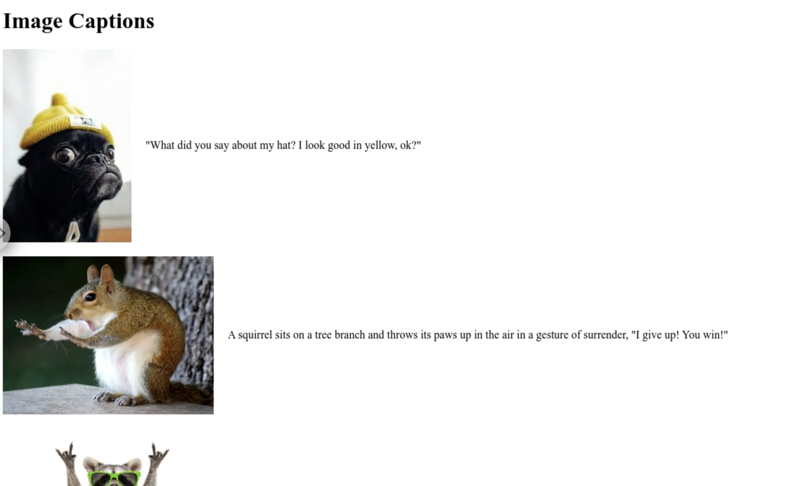

## Task1: What does this button do?
Lets try figuring out what this application does.

**Instructions**
1. Clear the current context in the chat window.
2. Clear all the files in the editor and open up the *app.py* file, the *client.py* file in the editor. 
3. Ask gemini to explain what the application does.
```
What does this application do?
```
You should get an explanation of the code that looks something like this

```
This application is a simple web server that displays images with captions generated by a Gemini image processing Cloud Function. Here's a breakdown of its functionality:

Initialization:

It sets up a Flask web application and defines a create_image_captions function.
It retrieves the PROJECT_ID and LOCATION environment variables, which are likely used to identify the Google Cloud project and region where the Cloud Function is deployed.
It defines a folder_path variable, which points to the directory containing the images.
Image Caption Generation:

The create_image_captions function iterates through the images in the specified folder.
For each image, it calls the generate_caption method of a GeminiImageClient object. This method likely sends the image data and a prompt to the Cloud Function, which then generates a caption.
The generated caption is stored in a dictionary, with the image filename as the key.
Web Server Routing:

The index function is defined as the route for the root URL (/).
It calls create_image_captions to get the image captions.
It renders the index.html template, passing the image_captions dictionary as a context variable.
Template Rendering:

The index.html template likely displays the images and their captions in a user-friendly way.
In summary, this application uses a Gemini image processing Cloud Function to generate captions for images and then displays them on a web page.


You can also view Gemini Code Assist logs to see the context sent to the LLM is. One of the two files (the one that is active on the editor), and the code (not the file) in the other file in the IDE context field, along with the context are sent to the LLM. 


```sh
{
  "conversation_requested": {
    "request": "#3654",
    "Input": "What does this application do?",
    "DocumentURI": "file:///code-assist/set2/image-caption-viewer/app/app.py",
    "SelectedRange": {
      "Start": {
        "Line": 0,
        "Character": 0
      },
      "End": {
        "Line": 0,
        "Character": 0
      }
    },
    "PrependInput": ""
  },
  "log_message": "I0605 11:59:20.398774   70018 client.go:177] GenerateChat request: {\"ideContext\":{\"currentFile\":{\"codeLanguage\":\"python\",\"content\":\"import os\\nfrom flask import Flask, render_template\\nfrom client import GeminiImageClient\\n\\napp = Flask(__name__)\\napp.config['TEMPLATE_FOLDER'] = 'templates'  // Add this line\\n\\ndef create_image_captions():\\n    project_id = os.environ.get(\\\"PROJECTID\\\")\\n    location = os.environ.get(\\\"LOCATION\\\")\\n    folder_path = \\\"images\\\"\\n\\n    if not project_id:\\n        raise ValueError(\\\"Environment variable for project id not set.\\\")\\n\\n    client = GeminiImageClient(project_id, location)\\n    image_captions = {}\\n\\n    // Get JPEG images from the folder\\n    for filename in os.listdir(folder_path):\\n        if filename.endswith(\\\".jpg\\\") or filename.endswith(\\\".jpeg\\\"):\\n            image_path = os.path.join(folder_path, filename)\\n            try:\\n                caption = client.generate_caption(image_path, \\\"Write a caption for this image.\\\")\\n                image_captions[filename] = caption  // Store filename as key\\n            except Exception as e:\\n                print(f\\\"Error processing {image_path}: {e}\\\")\\n\\n    return image_captions\\n\\n@app.route(\\\"/\\\", methods=[\\\"GET\\\"])\\ndef index():\\n        image_captions = create_image_captions() \\n        return render_template(\\\"./index.html\\\", image_captions=image_captions)\\n    \\n\\nif __name__ == \\\"__main__\\\":\\n    app.run(debug=True) \",\"filePath\":\"/Users/manasakandula/Desktop/code-assist/set2/image-caption-viewer/app/app.py\",\"selection\":{}},\"otherFiles\":[{\"codeLanguage\":\"python\",\"content\":\"import base64\\nimport requests\\nimport os\\n\\nclass GeminiImageClient:\\n    \\\"\\\"\\\"A client for interacting with the Gemini image processing Cloud Function.\\\"\\\"\\\"\n\\n    def __init__(self, project_id, location):\\n        \\\"\\\"\\\"Initializes the client with project ID and location.\\\"\\\"\\\"\n        self.project_id = project_id\\n        self.location = location\\n        self.cloud_function_url = f\\\"https://{location}-{project_id}.cloudfunctions.net/server\\\"\\n\\n    def generate_caption(self, image_path, prompt):\\n\\n        // Load the image\\n        with open(image_path, \\\"rb\\\") as image_file:\\n            image_data = image_file.read()\\n            encoded_image = base64.b64encode(image_data).decode(\\\"utf-8\\\")\\n\\n        // Create the request data\\n        data = {\\\"image\\\": encoded_image, \\\"prompt\\\": prompt}\\n\\n        // Send the POST request\\n        response = requests.post(self.cloud_function_url, data=data)\\n\\n        // Check for errors\\n        if response.status_code != 200:\\n            raise Exception(f\\\"Error processing image: {response.text}\\\")\\n\\n \"}"
}
```
## Task 2: Running the Image Caption Viewer

This task guides you through running a Flask server that displays images with captions. 

**Prerequisites:**

1. **Docker and Docker Compose:** Ensure you have Docker and Docker Compose installed on your machine.
2. **Environment Variables:** Set the `PROJECT_ID` and `LOCATION` environment variables in the `set2/image-caption-viewer/docker-compose.yaml` file.


**Running the Application:**

1. Navigate to the directory:
   ```sh
   cd set2/image-caption-viewer
   ```

Start the server:
```sh
docker-compose up
```
Access the webserver: Navigate to http://localhost:5000 in your web browser.

Expected Output:

The webpage should display images with captions, resembling the image here. Granted, it isn't the best looking webpage and it takes a long time to load.



**Does it load as expected?**

**Troubleshooting**:
You should see this error in the terminal:

```sh
Error: FileNotFoundError: [Errno 2] No such file or directory: 'images'
```
**Instructions**
1. Provide as much context as possible. Make sure you have *app.py*, *client.py*, *Dockerfile*, *Docker-compose.yaml*, and *index.html* open to ensure it is loaded into the context. This is necessary at this stage as the current version of Code Assist does not yet index the context of the files in the local directory. This feature is still in private preview.
2. Ask Code Assist for help. Type in the question. 
```
Why am I getting this error? Error: FileNotFoundError: [Errno 2] No such file or directory: 'images'
```
There are multiple ways to solve this problem.
The main reason this is happening is because the app is looking for images in the *app/images*, whereas the images are being mounted in the *app/static* folder. 
You can prompt Gemini further by asking:

```
What is the quickest way to fix this?
```


   